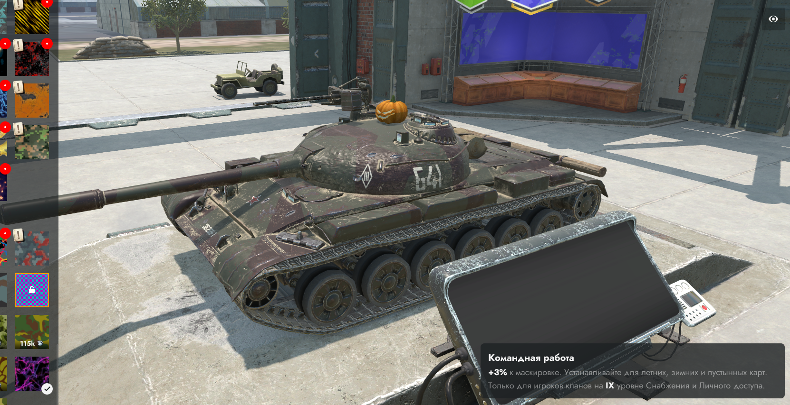

# Dava Skin Swither
### Описание
 • Публичная версия мода Dava Skin Swither, который направлен на визуальную разблокировку камуфляжей.
 • В данном репозитории лежат файлы для установщика и файлы с описанием структуры мода для ознакомления.
 
 • Tanks Blitz [LESTA] Version:
 • WoT Blitz [WG] Version:

### Прочие инструкции
* [Main Readme](.info/local/README.TXT)

* [YAML Info](.info/local/YAML.YAML)

* [XML Info](.info/local/XML.XML)

### Установка
1. Скачайте `python` с официального сайта.
2. Скачайте все нужные модули для скриптов.
3. Используйте как это описано в инструкции.
